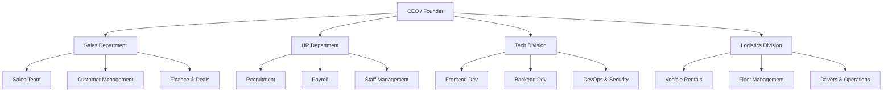
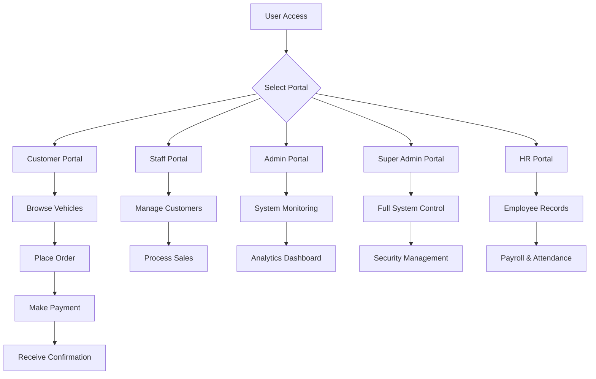
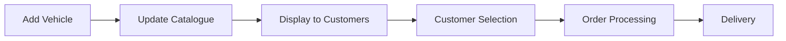
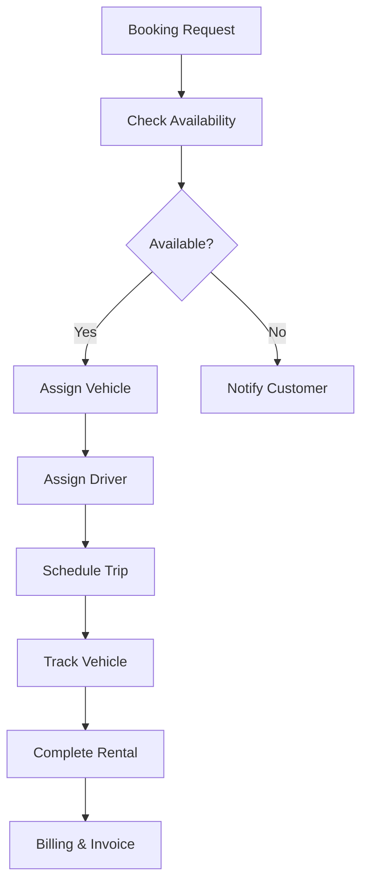
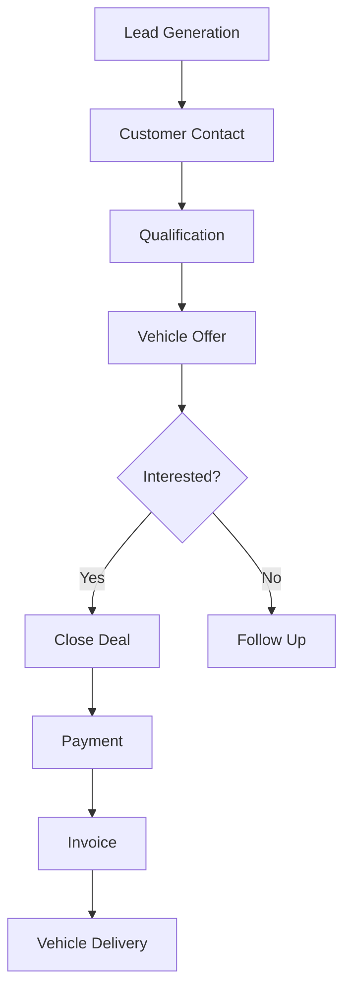
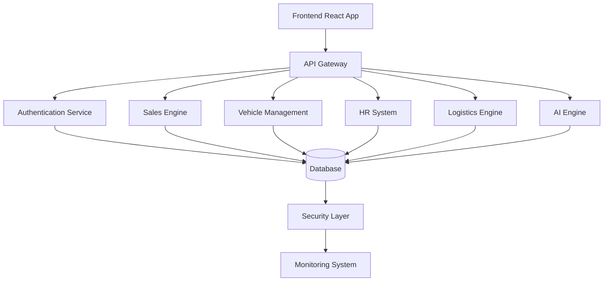
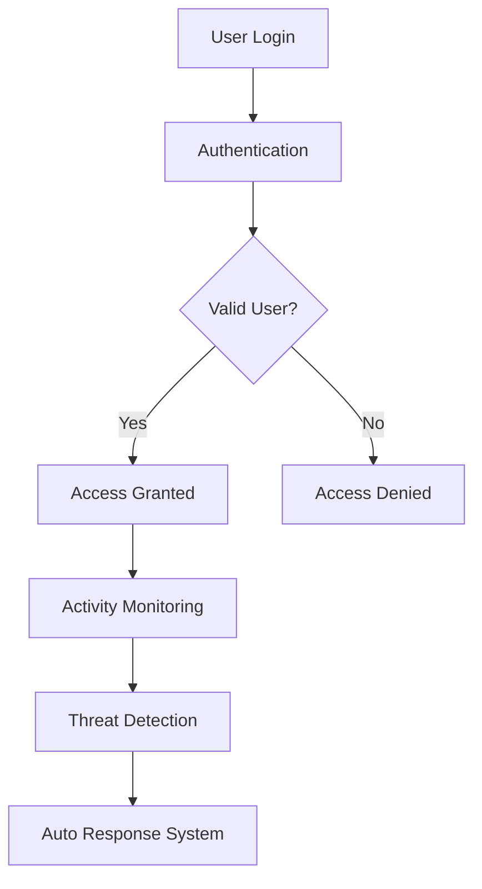

<!-- Justice Ultimate Automobiles System - FULL ENTERPRISE README -->

<h1 style="color:#00bfff;">🚀 Justice Ultimate Automobiles System (JUA)</h1>

<strong>Ultimate Systems • Trusted Car Masters • Enterprise Automotive Intelligence</strong>

---

<h2 style="color:#ffa500;">🌐 Official Domains</h2>

* 🌍 https://justiceultimateautomobiles.com
* 🇰🇪 https://justiceultimateautomobiles.co.ke *(Launching Soon)*

---

<h2 style="color:#ffa500;">🏢 Company Overview</h2>

<strong>Justice Ultimate Automobiles</strong> is a next-generation automotive and logistics technology company built by <strong>Daniwest Tech Sol</strong>.

<ul>
<li>🚗 Automotive Sales & Dealership Systems</li>
<li>🚚 Logistics Division: <strong>Justice Corporate Logistics Kenya</strong></li>
<li>👥 HR, Staff & Customer Ecosystem</li>
<li>📊 AI Business Intelligence Systems</li>
<li>🔐 Advanced Cybersecurity Infrastructure</li>
</ul>

🕒 Development: <strong>2+ Years</strong> 
💻 Commits: <strong>1000+ Git Commits</strong> 
🚀 Status: <strong>Actively Evolving Enterprise System</strong>

---

<h2 style="color:#ffa500;">🏗️ COMPANY STRUCTURE FLOWCHART</h2>

---

<h2 style="color:#ffa500;">🔄 FULL SYSTEM FLOW</h2>

---

<h2 style="color:#ffa500;">🚗 VEHICLE MANAGEMENT FLOW</h2>

---

<h2 style="color:#ffa500;">🚚 LOGISTICS & RENTALS FLOW</h2>

---

<h2 style="color:#ffa500;">📊 SALES PIPELINE FLOW</h2>

---

<h2 style="color:#ffa500;">🧠 SYSTEM ARCHITECTURE</h2>

---

<h2 style="color:#ffa500;">🔐 SECURITY FLOW</h2>

---

<h2 style="color:#ffa500;">⚡ SYSTEM FEATURES</h2>

<ul>
<li>🚗 Full vehicle catalogue management</li>
<li>📦 Logistics & rentals system</li>
<li>📩 Email + WhatsApp notifications</li>
<li>🤖 AI chatbot assistant</li>
<li>📊 Business intelligence dashboard</li>
<li>⚡ Fast customer response system</li>
<li>🔐 Multi-role authentication</li>
<li>📈 Real-time analytics</li>
</ul>

---

<h2 style="color:#ffa500;">🔐 ADVANCED SECURITY</h2>

<ul>
<li>🔒 End-to-end encryption</li>
<li>🛡️ Military-grade security architecture</li>
<li>⚛️ Quantum cryptography-ready systems</li>
<li>📡 Real-time threat monitoring</li>
<li>🔑 Secure authentication (2FA)</li>
</ul>

---

<h2 style="color:#ffa500;">🧠 AI SYSTEMS</h2>

<ul>
<li>AI customer behavior analysis</li>
<li>Predictive sales analytics</li>
<li>Automated chatbot responses</li>
<li>Fraud detection systems</li>
<li>Smart recommendations engine</li>
</ul>

---

<h2 style="color:#ffa500;">🛠️ TECHNOLOGY STACK</h2>

<ul>
<li>⚛️ React + Vite</li>
<li>📘 TypeScript</li>
<li>🎨 Tailwind CSS</li>
<li>🗄️ Supabase (Database & Auth)</li>
<li>🖥️ Node.js Backend</li>
</ul>

---

<h2 style="color:#ffa500;">⚙️ INSTALLATION</h2>

<pre>
git clone https://github.com/your-repo.git
cd justice-ultimate-automobiles
npm install
npm run dev
</pre>

---

<h2 style="color:#ffa500;">🚀 DEPLOYMENT</h2>

<ul>
<li>Build: npm run build</li>
<li>Deploy: Vercel / AWS / Netlify</li>
<li>Enable HTTPS SSL Security</li>
</ul>

---

<h2 style="color:#ffa500;">📈 DEVELOPMENT STATUS</h2>

<ul>
<li>✔ 2+ Years Development</li>
<li>✔ 1000+ Commits</li>
<li>✔ Continuous Updates</li>
<li>✔ Enterprise Scaling</li>
</ul>

---

<h2 style="color:#ffa500;">📞 CONTACT</h2>

📞 0722827458 
📞 0701460110 
📧 support@justiceultimateautomobiles.com

---

<h2 style="color:#ffa500;">📜 LICENSE</h2>

This system is proprietary and owned by <strong>Justice Ultimate Automobiles</strong>.  
Unauthorized use or distribution is strictly prohibited.

---

🚀 Daniwest Tech Sol — Engineering Africa’s Most Advanced Automotive & Logistics Platform

