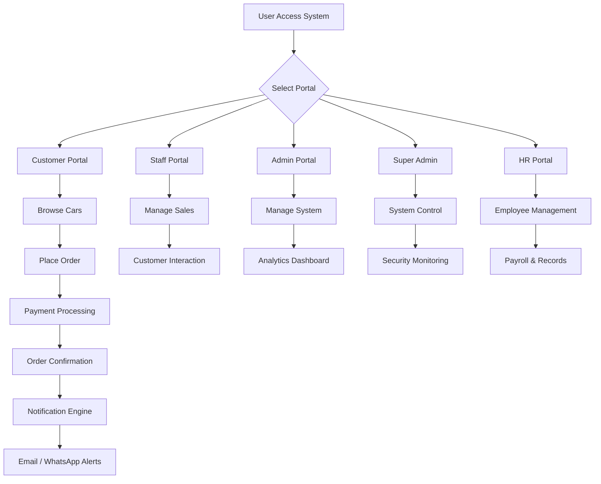
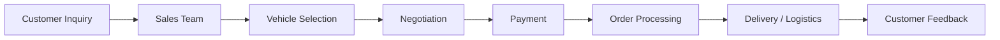
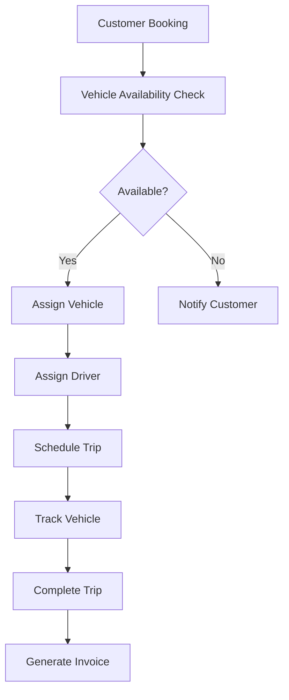
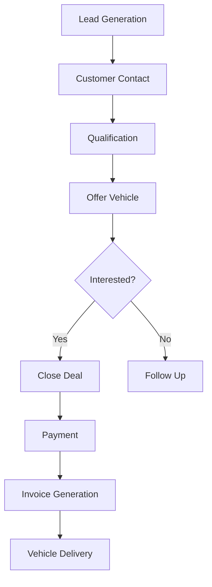
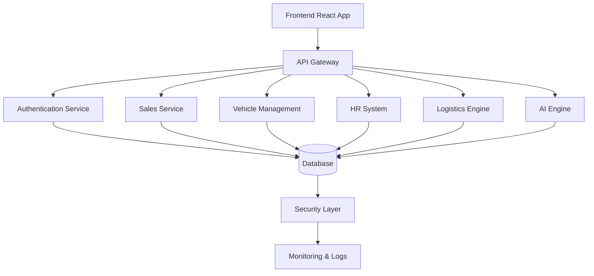
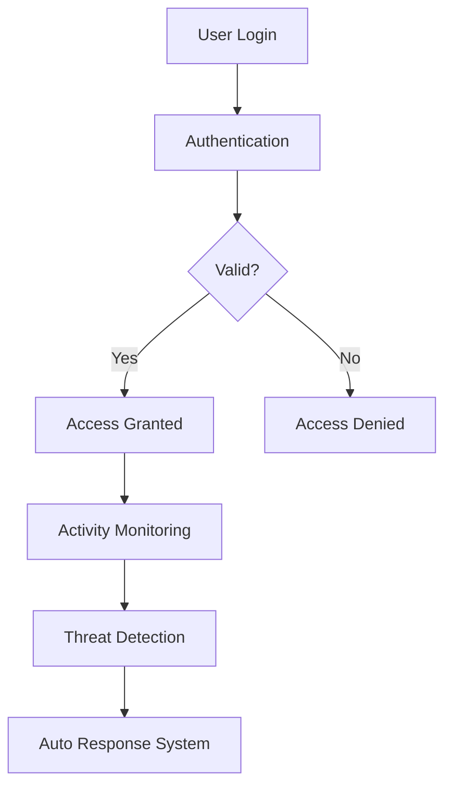

<!-- Justice Ultimate Automobiles System - Advanced README with Flowcharts -->

<h1 style="color:#00bfff;">🚀 Justice Ultimate Automobiles System (JUA)</h1>

<strong>Ultimate Systems • Trusted Car Masters • Enterprise Automotive Intelligence</strong>

---

<h2 style="color:#ffa500;">🌐 Live Domains</h2>

* 🌍 https://justiceultimateautomobiles.com
* 🇰🇪 https://justiceultimateautomobiles.co.ke *(Launching Soon)*

---

<h2 style="color:#ffa500;">📌 Overview</h2>

Enterprise automotive ecosystem with logistics, AI, and advanced security built over <strong>2+ years</strong> and <strong>1000+ commits</strong>.

---

<h2 style="color:#ffa500;">🔄 SYSTEM FLOWCHART</h2>

---

<h2 style="color:#ffa500;">🏢 COMPANY PROCESS FLOW</h2>

---

<h2 style="color:#ffa500;">🚚 LOGISTICS & RENTALS FLOW (Justice Corporate Logistics Kenya)</h2>

---

<h2 style="color:#ffa500;">📊 SALES SYSTEM FLOW</h2>

---

<h2 style="color:#ffa500;">🧠 SYSTEM ARCHITECTURE FLOW</h2>

---

<h2 style="color:#ffa500;">🔐 SECURITY FLOW</h2>

---

<h2 style="color:#ffa500;">⚡ KEY FEATURES</h2>

<ul>
<li>AI-powered analytics</li>
<li>Real-time notifications (Email + WhatsApp)</li>
<li>Advanced chatbot system</li>
<li>Vehicle & logistics management</li>
<li>Secure multi-role access system</li>
</ul>

---

<h2 style="color:#ffa500;">📈 DEVELOPMENT</h2>

<ul>
<li>✔ 2+ Years Active Development</li>
<li>✔ 1000+ Commits</li>
<li>✔ Continuous System Scaling</li>
</ul>

---

<h2 style="color:#ffa500;">📞 CONTACT</h2>

📞 0722827458  
📞 0701460110  
📧 support@justiceultimateautomobiles.com  

---

🚀 Daniwest Tech Sol — Building Africa’s Most Advanced Automotive Platform

